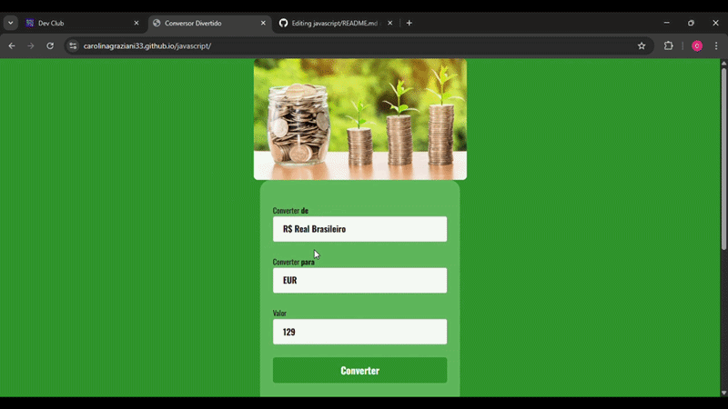

# PrimeiroProjeto 🚀

> Projeto em JavaScript desenvolvido para praticar manipulação de DOM, eventos e interações do usuário.

---

## 🔹 Descrição

Este projeto é um **exemplo de aplicação web** usando HTML, CSS e JavaScript. Ele mostra funcionalidades básicas como:

- Manipulação de elementos HTML via JavaScript
- Eventos de clique e interatividade
- Validação e exibição dinâmica de conteúdo

O objetivo é **aprimorar habilidades de front-end** e criar um projeto funcional para aprendizado.

---

## 💻 Tecnologias

- **HTML5**
- **CSS3**
- **JavaScript (ES6)**

---

## 📂 Estrutura do projeto

